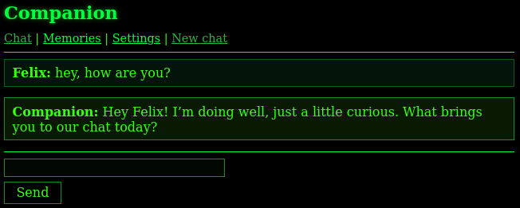

# Chīsai (小さい)
[简体中文](README.md) | [English](README-EN.md) | 日本語

あえてシンプルに作られた、AIコンパニオン向けのPHP製Web UIです。R*plika AI、[HCMS](https://atomgit.com/felixfester/HCMS)、Odysseus、[ch.at](http://ch.at) にインスパイアされています。

> 現在は開発の初期段階で、テストは約30%しか行っていません。AIが生成したテキスト/コード*が多く含まれていること、また一部の機能が本来の想定どおりに動作しない_可能性がある_ことをご了承ください。最新情報などは[Telegramチャンネル](https://t.me/+fgCDiyU802s1NWZi)または [bilibili](https://space.bilibili.com/661091175/) でご覧いただけます。

## 機能

- **チャット** - ローカルAIモデル専用です。チャット履歴は自動的に `data/chats/` にファイルとして保存されます。
- **セッション** - 各会話は `localhost/index.php?sid=....` のような固有のURLからアクセスできます。過去のチャット履歴ファイルを探し、そのファイル名に含まれるIDを `?sid=...` の後ろに付けると、開いて会話を続けることもできます。ただし、AIモデルにはあまり効果がないかもしれません。
- **メモリ / RAG** - テキストファイルからコンテキストを取得します。`data/memories/` に手動で、またはUI上で新しいテキストファイルを作成できます。Markdownファイルにも対応しています。
- **軽量でプライベート** - JavaScriptなし、Cookieなし、Composerなし。どのブラウザでも動作するはずの、現代風のWAPインターフェースです。トラッカーなし、収益化なし。

## インストール

1. ソースコードをダウンロードします。
2. ターミナルで `curl -LsSf https://llama.app/install.sh | sh` を実行して llama.cpp をインストールします。これは[こちらのサイト](https://llama.app/)で紹介されている方法です。ほかの入手方法は[こちら](https://github.com/ggml-org/llama.cpp#quick-start)にもあります。
3. [公式サイト](https://www.php.net/downloads.php)から PHP をインストールします。Linux の場合は、ディストリビューションのリポジトリから php を入れるだけでも構いません。
4. Chisai のフォルダを開き、そこでターミナルを開いて `php -S 127.0.0.1:8666` を実行します。
5. ターミナルで新しいタブまたはウィンドウを開き、同様に `~/.llama-app/llama serve -m /path/to/model.gguf --port 8080` を実行します。
6. ブラウザで `127.0.0.1:8666/setup.php` を開いて開始します。

docs フォルダに、詳しい情報や追加の手順があります。

## llama.cpp なしでテストする

1. モックサーバーを起動します：`php -S 127.0.0.1:8081 test/mock_llamacpp_server.php`
2. 初回起動時に setup.php で llama.cpp サーバーのURLを `http://127.0.0.1:8081/v1/chat/completions` に変更するか、`data/config.php` の `llamacpp_endpoint` パラメータを変更します。

## おすすめのモデルは？

1. [Llama-3.1-8B-Instruct](https://huggingface.co/unsloth/Llama-3.1-8B-Instruct-GGUF)（約6GB RAM）🌟
2. [gemma-3-1b-it](https://huggingface.co/ggml-org/gemma-3-1b-it-GGUF)（約4GB RAM）
3. [Llama-3.2-3B-Instruct](https://huggingface.co/unsloth/Llama-3.2-3B-Instruct-GGUF)（約3GB RAM）
4. [Llama-3.2-1B-Instruct](https://huggingface.co/unsloth/Llama-3.2-1B-Instruct-GGUF)（約1.5GB RAM）
5. [gemma-3-270m-it](https://huggingface.co/unsloth/gemma-3-270m-it-GGUF)（約0.8GB RAM）
6. [LFM2.5-230M](https://huggingface.co/LiquidAI/LFM2.5-230M-GGUF)（約0.5GB RAM）

RAMの数値は Q4_K_M 量子化（ローカル利用における標準的な最適点）を前提としています。実際の使用量は、選択した量子化方式、コンテキスト長、システムのオーバーヘッドによって変わります。

[Hugging Face](https://huggingface.co/models) でさらに探せます。

## 動作要件

- `curl` 拡張**または** `allow_url_fopen` が有効な PHP。
- 接続可能な llama.cpp の `llama-server`（同じマシンまたはLAN内）。
- 最低2GBのRAM。コンパニオンにふさわしい、より高度で賢いモデルを使うには**8GB以上を推奨**します。

現在のところ、インストールと簡単なテストは Linux でのみ行っています。Linux 以外でも Chīsai をインストールすること自体は可能ですが、Windows、Mac OS、Android では見た目や動作が一部異なる可能性があります。

----

*Claude Sonnet 5、GLM-5.3-Flash、ChatGPT の大きな助けを借りて作成しました <3
Translated by Claude Sonnet 5.5.
